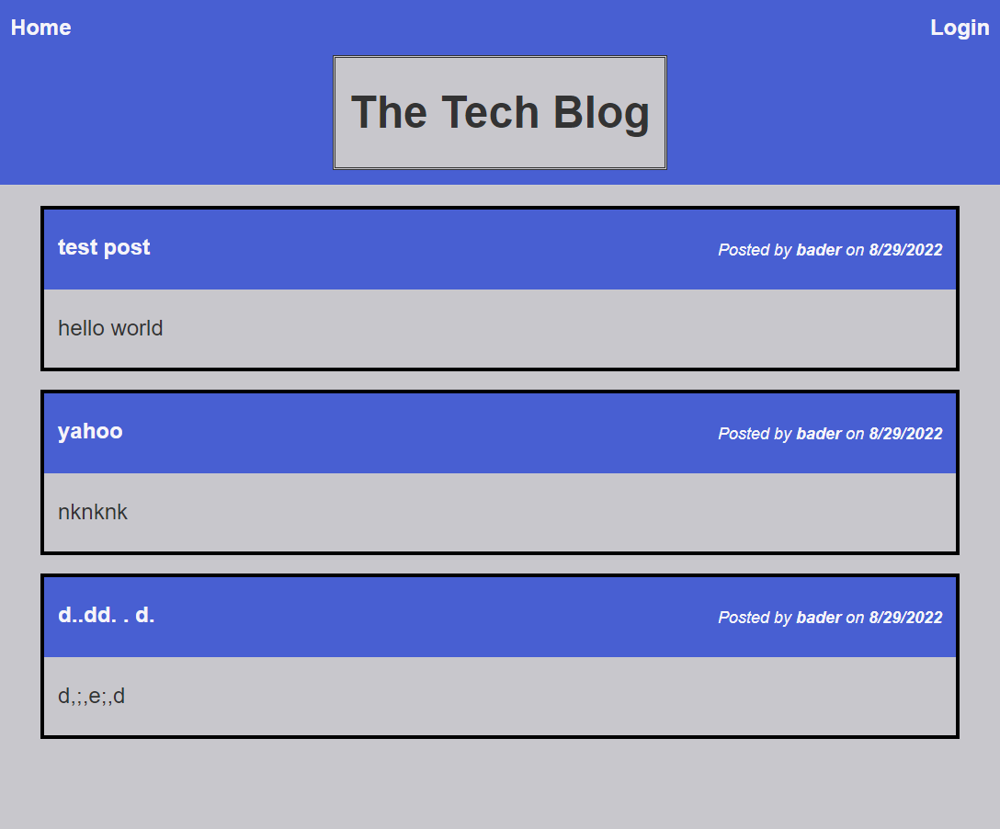

# Tech-Blog

  
  ## Description:

  A techblog for users to register and create posts for conversation with like minded people. 
  You can edit posts and even delete post from you dashboard. You can also view other blog posts and leave messages.


  # Table of Contents

  - [Installation](#installation)
  - [Usage](#usage)
  - [Credits](#credits)
  - [License](#license)
  - [Contribution](#contributing)
  - [Screenshot](#screenshot)
  - [deployed](#deployed-link)
  - [Contact](#contacts)

  
  ## Installation:

  * run ```npm install``` in terminal to install the dependencies. 
  * type ```node server.js``` in the console to run the server.
  * open ```http://localhost:3001``` in your web browser.

  
  ## Technologies
  - JavaScript
  - Nodejs
  - Sequelize
  - MYSQL
  - Handlebars.js

  ## Usage:

   tech blog that user can register and post and edit

  ## Credits:

  Made by Bader Munir


  ## License:

  For more information about licenses, please visit:

  [License](https://opensource.org/licenses/MIT)


  ## Contributing:
  
  It is open source

  ## Screenshot:

  

  ## deployed link
  https://evening-inlet-89063.herokuapp.com/

  
  ## Contact:

  - [Github Profile](https://github.com/XBaderM)

  - [Email](bader.munir18@googlemail.com)
  
 

